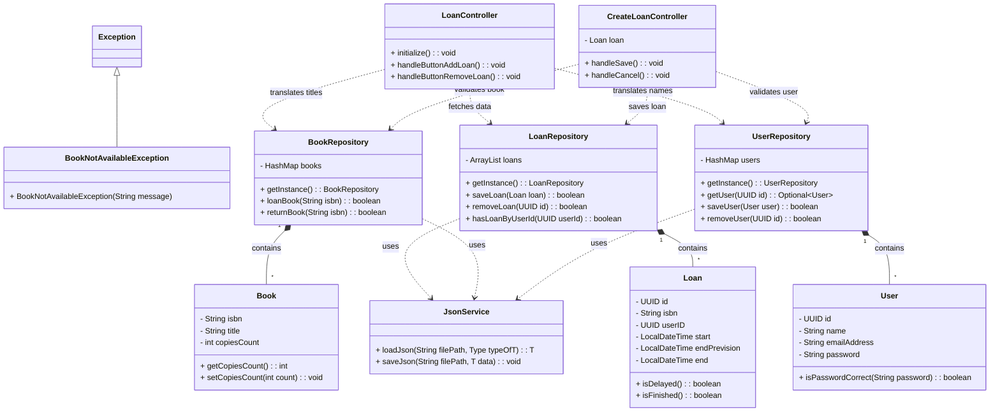

# JavaLibrary - SCC0504

**Projeto:** Sistema de Gerenciamento de Biblioteca (Compact Version)
**Disciplina:** SCC0504 - Programação Orientada a Objetos

## Equipe Desenvolvedora
* **Marcos Vinicius Reballo** - Nº USP: 7576746
* **Arthur Gagliardi Azorli** - Nº USP: 16855452
* **Pedro Kemp** - Nº USP: 17064431

## Sobre o Projeto
O JavaLibrary é uma aplicação desktop desenvolvida em Java utilizando a interface gráfica **JavaFX**. O sistema visa atender aos requisitos da disciplina implementando as principais operações de gestão de uma pequena biblioteca:
* Cadastro, edição e deleção de Livros (com controle rígido de cópias ativas).
* Cadastro, edição e deleção de Usuários/Clientes (Patrons).
* Realização de Empréstimos e devoluções garantindo a disponibilidade em estoque de livros.

O sistema foca fortemente na aplicação dos conceitos da Programação Orientada a Objetos (Herança, Encapsulamento, Polimorfismo) e faz uso de persistência local de dados no formato JSON (`books.json`, `users.json`, `loans.json`).

## Como Executar
### Pré-requisitos
* **Java 21** (JDK 21) instalado e configurado no ambiente.
* **Maven** instalado e mapeado na variável de ambiente (ou utilizar o *wrapper* local `mvnw`).

### Compilação e Execução
1. Abra um terminal de sua preferência (Prompt de Comando ou PowerShell).
2. Navegue até a pasta raiz do projeto (onde este arquivo `README.md` e o `pom.xml` se encontram).
3. Execute o comando Maven abaixo para baixar as dependências automaticamente, realizar o *build* do código e inicializar a interface gráfica:
   ```bash
   mvn clean javafx:run
   ```

*(Nota: Caso você não possua o Maven instalado globalmente, usuários de Windows podem usar o script incluso no projeto digitando `.\mvnw.cmd clean javafx:run`)*

## Suíte de Testes Automatizados
O projeto conta com uma suíte de testes unitários e de integração desenvolvida com **JUnit 5 (Jupiter)**. Os testes cobrem:
* **Criptografia (`CriptoTest`):** Validação do hashing de senhas com algoritmo MD5.
* **Modelos de Domínio (`UserTest`, `BookTest`, `LoanTest`):** Validação de regras de negócio, cálculo de atrasos (`isDelayed`) e igualdade estrutural.
* **Repositórios (`RepositoryIntegrationTest`):** Testes de persistência de dados de usuários, livros e empréstimos.
  *(Nota: Um sistema de backup automático é acionado nos testes de integração para evitar sobrescrever seus arquivos de dados locais).*

### Como Executar os Testes
Navegue até a pasta raiz do projeto e execute:
```bash
mvn test
```
*(Caso não possua o Maven global, execute `.\mvnw.cmd test`)*

### Resultados Obtidos
A suíte executa 16 casos de teste, todos homologados e com 100% de aproveitamento:
```txt
-------------------------------------------------------
 T E S T S
-------------------------------------------------------
Running br.edu.usp.javalibrary.javalibrary.service.domains.BookTest
Tests run: 3, Failures: 0, Errors: 0, Skipped: 0
Running br.edu.usp.javalibrary.javalibrary.service.domains.LoanTest
Tests run: 3, Failures: 0, Errors: 0, Skipped: 0
Running br.edu.usp.javalibrary.javalibrary.service.domains.UserTest
Tests run: 4, Failures: 0, Errors: 0, Skipped: 0
Running br.edu.usp.javalibrary.javalibrary.service.repository.RepositoryIntegrationTest
Tests run: 3, Failures: 0, Errors: 0, Skipped: 0
Running br.edu.usp.javalibrary.javalibrary.service.utils.CriptoTest
Tests run: 3, Failures: 0, Errors: 0, Skipped: 0

Results :

Tests run: 16, Failures: 0, Errors: 0, Skipped: 0

[INFO] BUILD SUCCESS
```

## Arquitetura Básica (Visão Geral)
* O fluxo principal inicia na classe `MainApplication.java`, encarregada de inicializar o `Stage` do JavaFX.
* A camada visual encontra-se no pacote `view`, interligada a Controladores responsáveis pelas lógicas gráficas dos arquivos `.fxml`. 
* A manipulação, integridade e as regras de negócio encontram-se nos Modelos dentro de `domains` (`Book`, `User`, `Loan`).
* Todo o controle de estado e memória da aplicação são isolados por Repositórios e consumidos dinamicamente pela Interface, o que pode ser analisado no diagrama de classes UML a seguir (ou através do arquivo PlantUML nativo incluso na pasta `UML_Class_Diagram.puml`).

### Diagrama de Classes UML


